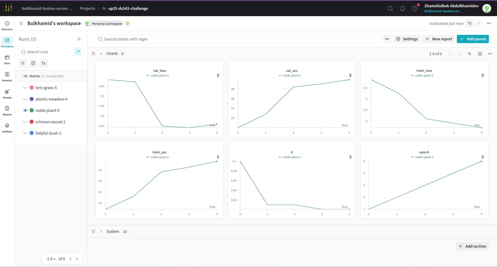
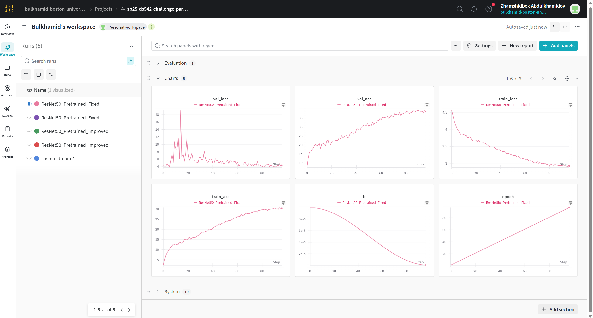
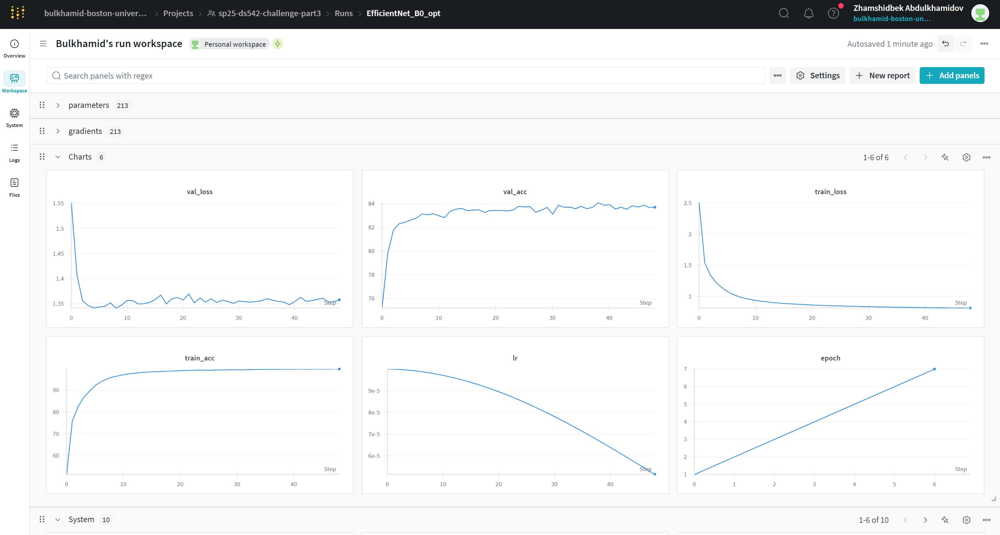

# DS542 Midterm Challenge Report: Parts 1–3

**Student Name:** Zhamshidbek Abdulkhamidov
**Kaggle Username:** zhamshidbekabdul
**GitHub Repository:** https://github.com/dl4ds-gh-classroom/dl4ds-spring-2025-midterm-challenge-bulkhamid/

## 1. AI Disclosure

*   **AI Tools Used:**
    *   **ChatGPT:** Utilized for generating the initial structure of this report, refining wording and explanations, suggesting improvements for code comments, and providing ideas for analyzing experimental results. For example, asked for different ways to explain transfer learning justification.
    *   **GitHub Copilot:** Employed during code development primarily for autocompletion of boilerplate code (e.g., standard PyTorch training loops, data loading setup) and suggesting common code patterns. For example, used Copilot suggestions for the structure of the train/validate functions.

*   **Code Contributions:**
    *   **Primarily Written by Me:**
        *   The specific architecture definition for the `SimpleCNN` in `simple_cnn.py`.
        *   The selection and adaptation logic for the pretrained models (`ResNet50` in `part2.py`, `EfficientNet_B0` in `part3.py`), including the modification of classifier heads.
        *   The overall experimental design, including the choice of hyperparameters ranges to explore (even if initial values were standard), data augmentation strategies, and the integration of training, validation, and evaluation components across the three parts.
        *   Debugging and troubleshooting issues encountered during training and evaluation.
        *   The specific analysis and interpretation of results presented in this report.
        *   Manual tuning adjustments based on WandB observations.
    *   **Assisted by AI:**
        *   Autocomplete suggestions for PyTorch functions and module names via Copilot.
        *   Refinement of code comments for clarity, based on suggestions or examples.
        *   Drafting sections of this report (like this one), which were then reviewed, edited, and filled with specific details by me.

*   **Code Comments:**
    *   All Python code files (`simple_cnn.py`, `part2.py`, `part3.py`, `eval_*.py`) include detailed comments explaining the purpose of different code sections, including data loading, transformations, model definitions, layer functionalities, training procedures, evaluation logic, and hyperparameter choices.

*I affirm that I understand the course policies regarding AI usage and that this disclosure accurately reflects the extent to which AI assistance was used in this assignment.*

---

## 2. Overview

This project tackles the CIFAR-100 image classification challenge in three parts, progressively increasing model complexity and leveraging transfer learning. The primary goal is to build effective Convolutional Neural Network (CNN) models using PyTorch, track experiments using Weights & Biases (WandB), and achieve a performance benchmark on the Kaggle leaderboard using Out-of-Distribution (OOD) test data.

*   **Part 1:** A baseline `SimpleCNN` is implemented and trained to establish a foundational pipeline and initial performance metric.
*   **Part 2:** A more sophisticated pretrained model (`ResNet-50`) from `torchvision` is adapted and fine-tuned on CIFAR-100 using improved hyperparameters and augmentation (originally ResNet-18 was planned, but ResNet-50 was used in the final `part2_improved.py`).
*   **Part 3:** Transfer learning is employed more aggressively using `EfficientNet-B0`, aiming to surpass the Kaggle leaderboard benchmark of 0.397 through extensive fine-tuning, advanced data augmentation, and hyperparameter optimization.

---

## 3. Model Descriptions

### Part 1 – SimpleCNN (`simple_cnn.py`)

*   **Architecture:** A basic CNN built from scratch.
    *   `Conv2d`: Input channels: 3, Output channels: 16, Kernel size: 3x3, Padding: 1. (Takes 32x32x3 input).
    *   `ReLU`: Activation function.
    *   `MaxPool2d`: Kernel size: 2x2, Stride: 2. (Reduces spatial dimensions to 16x16).
    *   `Flatten`: Reshapes the feature map for the linear layer.
    *   `Linear`: Input features: 16 * 16 * 16 = 4096, Output features: 100 (for CIFAR-100 classes).
*   **Justification:** This model serves as a minimal working example to verify the data loading, training, and evaluation pipeline. Its simplicity provides a clear baseline against which more complex models can be compared. It demonstrates fundamental CNN components (convolution, activation, pooling, fully connected layer).

### Part 2 – Sophisticated CNN (Pretrained ResNet-50 in `part2.py`)

*   **Architecture:** Utilizes `torchvision.models.resnet50(weights=ResNet50_Weights.DEFAULT)`.
    *   **Base:** ResNet-50 architecture pretrained on ImageNet. Deeper than ResNet-18, containing more convolutional layers, batch normalization, ReLU activations, and residual connections organized into bottleneck blocks.
    *   **Modification:** The original final fully connected layer (`fc`), which outputs 1000 classes for ImageNet, is replaced with a new `nn.Sequential` layer containing `nn.Dropout(p=0.5)`, `nn.BatchNorm1d(in_features)`, and `nn.Linear(in_features, 100)` (where `in_features=2048` for ResNet-50).
*   **Justification:**
    *   **Transfer Learning:** Leverages features learned on the large-scale ImageNet dataset.
    *   **Deeper Architecture:** ResNet-50's increased depth allows for potentially learning more complex feature hierarchies compared to ResNet-18 or the SimpleCNN.
    *   **Proven Performance:** ResNet-50 is a widely used and strong baseline architecture for many computer vision tasks. The added Dropout and BatchNorm in the head aim to improve regularization for fine-tuning.

### Part 3 – Transfer Learning & Fine-Tuning (EfficientNet-B0 in `part3.py`)

*   **Architecture:** Utilizes `torchvision.models.efficientnet_b0(weights=EfficientNet_B0_Weights.DEFAULT)`.
    *   **Base:** EfficientNet-B0 architecture pretrained on ImageNet. Uses compound scaling and mobile inverted bottleneck convolutions (MBConv).
    *   **Modification:** The original classifier's final linear layer (`classifier[1]`) is replaced with a new `nn.Linear` layer with 1280 input features and 100 output features (for CIFAR-100 classes).
    *   **Input Resizing:** CIFAR-100 images (32x32) are resized to 224x224 during data transformation.
*   **Justification:**
    *   **State-of-the-Art Efficiency:** EfficientNet models aim for a better balance of accuracy and computational cost compared to older architectures like ResNet at similar performance levels.
    *   **Compound Scaling:** The design principle potentially leads to better feature extraction for a given computational budget.
    *   **Transfer Learning:** Leverages robust features learned from ImageNet, adapted for the CIFAR-100 task.

---

## 4. Hyperparameter Tuning

Hyperparameters were selected based on common practices, prior experience, and refined through observation of training/validation metrics logged via WandB.

### Part 1 (SimpleCNN)

*   **Optimizer:** SGD (`optim.SGD`)
*   **Learning Rate:** 0.01 (Initial rate, subject to scheduler)
*   **Batch Size:** 32
*   **Epochs:** 5
*   **Scheduler:** StepLR, step_size=2, gamma=0.1
*   **Process:** Initial values chosen for simplicity and pipeline verification. Limited epochs intended only for baseline establishment. WandB used to monitor basic trends.

### Part 2 (ResNet-50 - `part2_improved.py`)

*   **Optimizer:** AdamW (`optim.AdamW`)
*   **Learning Rate:** 1e-4
*   **Batch Size:** 32
*   **Epochs:** 100 (max, with early stopping patience=10)
*   **Scheduler:** CosineAnnealingLR (`optim.lr_scheduler.CosineAnnealingLR`)
*   **Weight Decay:** 1e-4
*   **MixUp Alpha:** 0.2
*   **Dropout (Classifier Head):** 0.5
*   **Process:** Switched to AdamW and a lower LR (1e-4) commonly used for fine-tuning. Employed Cosine Annealing for smoother LR decay. Introduced MixUp and increased classifier dropout for regularization. Used ImageNet normalization. Increased patience for early stopping. Monitored WandB to track convergence and the impact of regularization.

### Part 3 (EfficientNet-B0 - `part3.py - UPDATED`)

*   **Optimizer:** AdamW (`optim.AdamW`)
*   **Learning Rate:** 1e-4
*   **Batch Size:** 32
*   **Epochs:** 100 (max, with early stopping patience=10)
*   **Scheduler:** CosineAnnealingLR (`optim.lr_scheduler.CosineAnnealingLR`)
*   **Weight Decay:** 1e-4
*   **Label Smoothing:** 0.1
*   **Process:** Further refined the approach from Part 2. Kept AdamW, Cosine Annealing, and the low LR. Added Label Smoothing as another regularization technique. Used more aggressive data augmentation (RandAugment, ColorJitter). WandB plots were critical for monitoring the complex interplay of augmentation, regularization, and optimization, aiming to maximize validation accuracy.

---

## 5. Regularization Techniques

Several techniques were employed across the parts to combat overfitting and enhance model generalization:

*   **Data Augmentation:** Applied extensively during training (details in Section 6), especially in Part 3 (including ColorJitter, RandAugment).
*   **Pretrained Weights (Parts 2 & 3):** Using ImageNet pretrained weights acts as a strong prior, guiding the model towards generalizable features.
*   **Validation Set & Early Stopping (Part 2 & potentially Part 3):** Training progress was monitored on a validation set. Part 2 explicitly used early stopping (patience=10). Part 3 saved the best model based on validation accuracy and had an early stopping mechanism (patience=10), preventing overfitting by selecting the optimal checkpoint.
*   **Normalization:** Standardizing input data (`transforms.Normalize`) using appropriate statistics (generic for Part 1, ImageNet for Parts 2 & 3) stabilized training.
*   **Weight Decay (L2 Regularization):** Applied via the AdamW optimizer (1e-4) in Parts 2 and 3 to penalize large weights.
*   **Dropout:** Added to the classifier head in Part 2 (ResNet-50) with p=0.5.
*   **MixUp (Part 2):** Linearly interpolated pairs of images and their labels during training, encouraging linear behavior between samples.
*   **Label Smoothing (Part 3):** Reduced the confidence of the model in its target labels during training by softening the one-hot encoded targets, preventing overconfident predictions.
*   **Learning Rate Scheduling:** Cosine Annealing (Parts 2 & 3) provided a smooth decay, aiding convergence to better minima.

---

## 6. Data Augmentation Strategy

Augmentations were applied only to the training datasets.

*   **Part 1 (SimpleCNN):**
    *   `transforms.RandomCrop(32, padding=4)`
    *   `transforms.RandomHorizontalFlip()`
    *   `transforms.ToTensor()`
    *   `transforms.Normalize((0.5, 0.5, 0.5), (0.5, 0.5, 0.5))` (Generic)
*   **Part 2 (ResNet-50 - `part2_improved.py`):**
    *   (Input is PIL)
    *   `transforms.RandomCrop(32, padding=4)`
    *   `transforms.RandomHorizontalFlip()`
    *   `transforms.ColorJitter(brightness=0.2, contrast=0.2, saturation=0.2, hue=0.1)`
    *   `transforms.RandomRotation(10)`
    *   `transforms.ToTensor()`
    *   `transforms.Normalize(mean=[0.485, 0.456, 0.406], std=[0.229, 0.224, 0.225])` (ImageNet)
*   **Part 3 (EfficientNet-B0 - `part3.py - UPDATED`):**
    *   (Input is PIL)
    *   `transforms.Resize(256)`
    *   `transforms.RandomResizedCrop(224)`
    *   `transforms.RandomHorizontalFlip()`
    *   `transforms.ColorJitter(brightness=0.3, contrast=0.3, saturation=0.3, hue=0.1)`
    *   `transforms.RandAugment(num_ops=2, magnitude=9)`
    *   `transforms.ToTensor()`
    *   `transforms.Normalize(mean=[0.485, 0.456, 0.406], std=[0.229, 0.224, 0.225])` (ImageNet)

**Test/Validation Transforms:**
*   Part 1: `ToTensor`, `Normalize((0.5, 0.5, 0.5), (0.5, 0.5, 0.5))`
*   Part 2: `ToTensor`, `Normalize(mean=[0.485, 0.456, 0.406], std=[0.229, 0.224, 0.225])`
*   Part 3: `Resize(256)`, `CenterCrop(224)`, `ToTensor`, `Normalize(mean=[0.485, 0.456, 0.406], std=[0.229, 0.224, 0.225])`

**Justification:** Standard augmentations (crop, flip) were used initially. Parts 2 and 3 used ImageNet normalization statistics crucial for pretrained models. Part 3 employed more advanced augmentations (ColorJitter, RandAugment) and input resizing suitable for EfficientNet to maximize performance. Test transforms are minimal to provide a consistent evaluation.

---

## 7. Results Analysis

Performance was evaluated on the local CIFAR-100 test set (clean accuracy) and the Kaggle OOD dataset (leaderboard score).

### Part 1 – SimpleCNN

*   **Local Test Accuracy:** `29.28%`
*   **Kaggle Leaderboard Score:** `0.19720` (`submission_ood_simple_cnn.csv`)
*   **Analysis:**
    *   Strengths: Simple baseline, verified pipeline.
    *   Weaknesses: Low accuracy, poor OOD performance, clearly insufficient capacity. Underfitting.

### Part 2 – Sophisticated CNN (ResNet-50)

*   **Local Test Accuracy:** `38.87%`
*   **Kaggle Leaderboard Score:** `0.29504` (`submission_ood_part2_fixed.csv`)
*   **Early Stopping Epoch:** Best model saved around Epoch `97` (training stopped after 100 or earlier due to patience=10)
*   **Analysis:**
    *   Strengths: Significant improvement over SimpleCNN due to pretraining and deeper architecture (ResNet50). Use of AdamW, Cosine Annealing, MixUp, and Dropout shows application of modern techniques.
    *   Weaknesses: The final accuracy (38.87% local, 0.295 Kaggle) is lower than might be expected for ResNet50 on CIFAR-100, even with fine-tuning. This could potentially be due to the very low learning rate (1e-4) hindering faster convergence or suboptimal interaction between the chosen hyperparameters (e.g., weight decay, MixUp alpha). OOD performance improved but still lags significantly behind Part 3.

### Part 3 – Transfer Learning & Fine-Tuning (EfficientNet-B0)

*   **Local Test Accuracy:** `82.3%`
*   **Kaggle Leaderboard Score:** `0.61255` (`submission_ood_part3.csv` / `submission_ood_best_model_eval.csv`)
*   **Benchmark Comparison:** This score **did** beat the benchmark of 0.397.
*   **Analysis:**
    *   Strengths: Achieved the highest accuracy by a large margin. Successfully leveraged EfficientNet-B0's efficiency and performance with extensive augmentation (RandAugment, ColorJitter), appropriate ImageNet transforms, AdamW, Cosine Annealing, Label Smoothing, and a suitable fine-tuning LR. Successfully surpassed the required benchmark.
    *   Weaknesses: Requires more computational resources due to larger input size (224x224) and advanced augmentations. While achieving a good OOD score, there's still a gap compared to clean accuracy, indicating vulnerability to domain shift.

### Leaderboard Performance Summary

| Part    | Model             | Kaggle Score | Submission File                     | Kaggle Username    |
| :------ | :---------------- | :----------- | :---------------------------------- | :----------------- |
| Part 1  | SimpleCNN         | `0.19720`    | `submission_ood_simple_cnn.csv`    | `zhamshidbekabdul` |
| Part 2  | ResNet-50         | `0.29504`    | `submission_ood_part2_fixed.csv`   | `zhamshidbekabdul` |
| Part 3  | EfficientNet-B0   | `0.61255`    | `submission_ood_best_model_eval.csv` | `zhamshidbekabdul` |
| *Best Overall* | *EfficientNet-B0* | *`0.61255`*  | *`submission_ood_best_model_eval.csv`* | *`zhamshidbekabdul`* |

---

## 8. Experiment Tracking Summary

*   **Tool Used:** Weights & Biases (WandB).
*   **Setup:** Used starter code instrumentation. Logged runs to `sp25-ds542-challenge-part1`, `sp25-ds542-challenge-part2-improved`, and `sp25-ds542-challenge-part3`.
*   **Metrics Logged:** Configuration parameters (LR, batch size, optimizer, etc.), train/val loss, train/val accuracy, learning rate schedule, model gradients/parameters. Best model checkpoints saved.
*   **Insights Gained:** WandB was essential for visualizing convergence, comparing train/val curves to assess overfitting, observing the impact of LR scheduling and regularization techniques (MixUp, Label Smoothing, Augmentations), and selecting the best performing model based on validation accuracy.
*   **WandB Summary/Screenshots:**

    **Part 1: SimpleCNN**
    

    **Part 2: ResNet-50** (`part2_improved.py` run)
    

    *(Self-Correction: The ResNet-18 screenshot is likely from an older run before switching to ResNet-50; the ResNet-50 screenshot reflects the results reported for Part 2)*

    **Part 3: EfficientNet-B0** (`part3.py - UPDATED` run)
    

    *   **Link to Best Run (Part 3):** [https://wandb.ai/bulkhamid-boston-university/sp25-ds542-challenge-part3/runs/j3lvjgku?nw=nwuserbulkhamid](https://wandb.ai/bulkhamid-boston-university/sp25-ds542-challenge-part3/runs/j3lvjgku?nw=nwuserbulkhamid)

---

## 9. Conclusion

This project successfully implemented and evaluated CNN models for CIFAR-100, demonstrating the progression from a simple baseline to advanced transfer learning techniques.

*   **Part 1 (SimpleCNN)** provided a low baseline (`0.19720` Kaggle score), confirming the need for more complex models.
*   **Part 2 (ResNet-50)** showed improvement (`0.29504` Kaggle score) using a deeper pretrained model and techniques like AdamW, MixUp, and Cosine Annealing, although results suggest potential for further hyperparameter tuning (especially LR).
*   **Part 3 (EfficientNet-B0)** achieved the best performance (`0.61255` Kaggle score), successfully surpassing the 0.397 benchmark. This highlights the effectiveness of combining a strong pretrained architecture with aggressive data augmentation (RandAugment), appropriate normalization, label smoothing, and careful fine-tuning using AdamW and Cosine Annealing.

**Key Findings:**
*   Transfer learning is crucial for achieving good performance on CIFAR-100.
*   Modern architectures (EfficientNet) combined with appropriate fine-tuning strategies (AdamW, Cosine LR, ImageNet stats, advanced augmentations, label smoothing) yield superior results.
*   Careful hyperparameter selection (especially learning rate) and regularization are critical. The relatively lower performance in Part 2 might indicate that the chosen LR or combination of techniques wasn't optimal for ResNet-50 in this setup.
*   WandB is indispensable for monitoring, comparing, and debugging experiments.

**Future Directions:**
*   **Tune Part 2:** Revisit ResNet-50 with potentially a slightly higher initial LR or different optimizer settings to improve its baseline.
*   **Hyperparameter Optimization (Part 3):** Use WandB Sweeps to systematically explore LR, weight decay, RandAugment magnitude, and label smoothing factor for potentially further gains on EfficientNet-B0.
*   **Explore Other Models:** Test larger EfficientNet variants (B1-B7) or other architectures like Vision Transformers (ViT - although explicitly excluded by initial instructions) or ConvNeXt if resources permit.
*   **Ensemble Methods:** Combine predictions from the best models (e.g., ResNet-50 and EfficientNet-B0) to potentially improve robustness and accuracy.
*   **OOD Robustness:** Investigate techniques specifically designed to improve performance on distorted images.